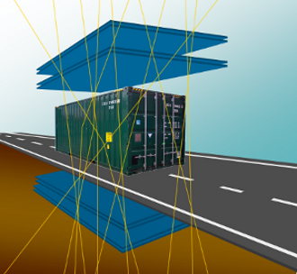

<p align="left">
  
</p>

# MuonPortalGUI
MuonPortal GUI for tomography data imaging processing

## **About**  
MuonPortalGUI is a C++ software tool to perform muon tomography imaging computation. It was developed within the MuonPortal project and it is distributed for research use only under the GNU General Public License v3.0. 

## **Credit**
If you use MuonPortalGUI for your research, please acknowledge it in your papers by citing the following paper:

* `S. Riggi et al., "Muon tomography imaging algorithms for nuclear threat detection inside large volume containers with the Muon Portal detector", Nucl. Instr. and Meth. A 728 (2013) 59`

or consider including me (`S. Riggi, INAF - Osservatorio Astrofisico di Catania, Via S. Sofia 78, I-95123, Catania, Italy`)
as a co-author on your publications.

## **Status**
This software is currently not actively maintained. Building with recent versions of GEANT4/ROOT/VTK/Qt may require fixing the Makefile. The software was used with:
* OS: Ubuntu 14.04/16.04, Centos 6
* QT 4 (not tested with QT 5)
* VTK 5 (not tested with VTK 6) 
* ROOT 5, 6
* GEANT 4.9.X

## **Installation**  

### **Prerequisites**
Install the system libraries & tools (example for Ubuntu):
* libphonon-dev libphonon4 phonon-backend-gstreamer
* libafterimage-dev
* unbuffer (sudo apt install expect)

Install the project mandatory dependencies:  
* ROOT [https://root.cern.ch/]
* GEANT4 [https://geant4.web.cern.ch/] 
* VTK [https://www.vtk.org/] 
* QT [https://www.qt.io], enable QVTKWidget build
* QJson [https://github.com/flavio/qjson.git]    
* MPI library: MPICH [https://www.mpich.org/] or OpenMPI [https://www.open-mpi.org/]
* boost [http://www.boost.org/]
* log4cxx [https://logging.apache.org/log4cxx/]

Make sure you have set the following environment variables to the external library installation dirs 
* ROOTSYS: set to ROOT installation prefix
* G4INSTALL: set to GEANT4 installation prefix
* G4LIB: set to GEANT4 installed library path
* VTK_INCDIR: set to VTK header path
* VTK_LIBDIR: set to VTK libray path
* LIBAFTERIMAGE_INCDIR: set to libAfterImage header path
* MPI_DIR: set to MPI installation prefix
* BOOST_ROOT: set to boost library installation prefix
* LOG4CXX_DIR: set to log4cxx library installation prefix
* QJSON_DIR: set to QJson installation prefix

NB: Modify Makefile CPPFLAGS and LDFLAGS in case the dependency tools cannot be found.

### **Build**
To build the project:

* Clone this repository into your local $SOURCE_DIR  
  ```git clone https://github.com/MuonPortal/MuonPortalGUI.git $SOURCE_DIR```
* In the project directory type:    
  ```make```  

Binaries will be placed in the bin/ directory.
